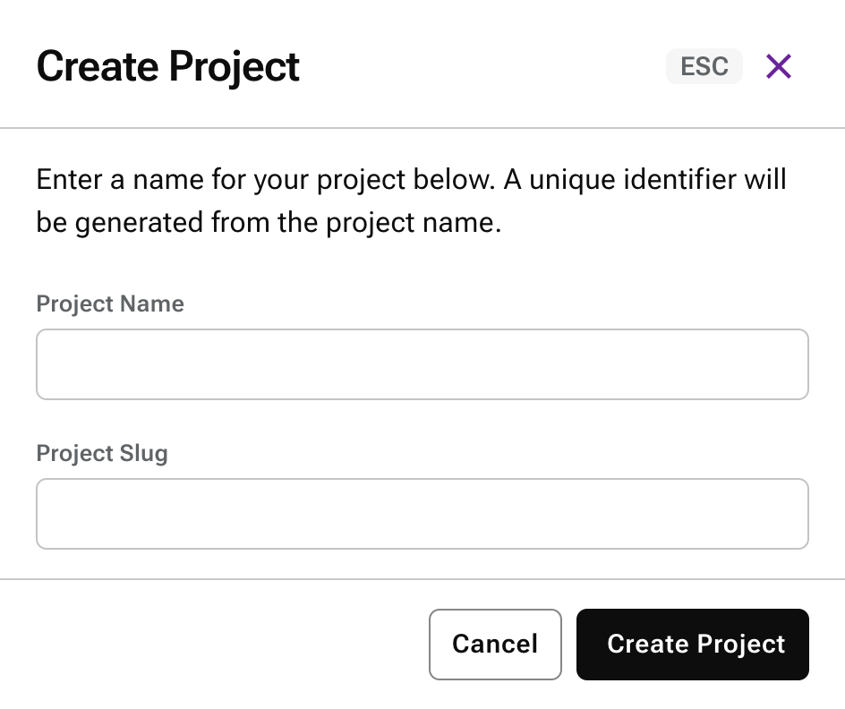

# HCD Cluster Installation Guide
This guide provides step-by-step instructions to configure and use HCD via the Mission Control UI. The setup includes:
1. Creating a Cassandra Cluster
1. Configuring Object Storage
1. Interacting with Stargate

# 1. Create the Project
A project is a placeholder abstraction of multiple clusters. A single project can host multiple clusters (basically an abstraction for organisation).

# 2. Creating a Cassandra Cluster
